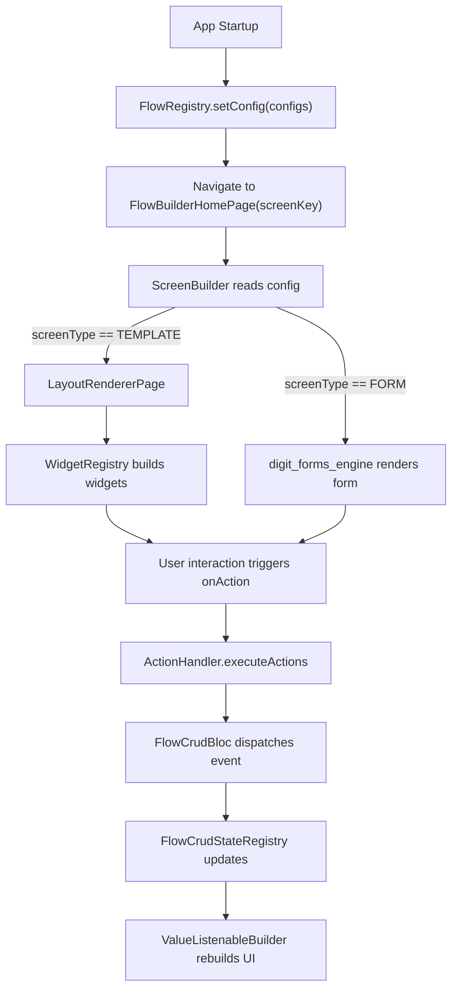

# DIGIT Flow Builder — Complete Documentation

> **Version**: 0.0.1 | **Platform**: Flutter | **Type**: JSON-driven UI Framework

---

## Table of Contents

1. [Overview](#overview)
2. [Architecture](#architecture)
3. [Getting Started](#getting-started)
4. [Flow Config Structure](#flow-config-structure)
5. [Screen Types](#screen-types)
6. [Action System](#action-system)
7. [Template Interpolation](#template-interpolation)
8. [Scroll Listener (Pagination)](#scroll-listener-pagination)
9. [Custom Widget Registration](#custom-widget-registration)
10. [Widget Templates](#widget-templates)
    - [button](#1-button)
    - [backLink](#2-backlink)
    - [card](#3-card)
    - [column](#4-column)
    - [row](#5-row)
    - [expandable](#6-expandable)
    - [textTemplate](#7-texttemplate)
    - [searchBar](#8-searchbar)
    - [infoCard](#9-infocard)
    - [tag](#10-tag)
    - [listView](#11-listview)
    - [table](#12-table)
    - [labelPairList](#13-labelpairlist)
    - [dropdownTemplate](#14-dropdowntemplate)
    - [radioList](#15-radiolist)
    - [selectionCard](#16-selectioncard)
    - [textInput](#17-textinput)
    - [switch (proximitySearch)](#18-proximitysearch)
    - [qrScanner](#19-qrscanner)
    - [qrView](#20-qrview)
    - [actionPopup](#21-actionpopup)
    - [filter](#22-filter)
    - [menu_card](#23-menu_card)
    - [panelCard](#24-panelcard)
    - [iconButton](#25-iconbutton)
11. [Best Practices](#best-practices)
12. [Troubleshooting](#troubleshooting)

---

## Overview

**DIGIT Flow Builder** is a JSON-driven dynamic UI rendering framework that builds complete screens and workflows from configuration objects registered in `FlowRegistry`. The host application registers flow configs (fetched from backend/MDMS), and the framework:

- Renders **FORM** screens via `digit_forms_engine`
- Renders **TEMPLATE** screens via `LayoutRendererPage` with 25+ built-in widgets
- Executes 12+ action types (create, update, search, navigate, scan QR, show toast, etc.)
- Manages state per screen instance via `FlowCrudStateRegistry`
- Supports template interpolation with `{{key}}` syntax

### Key Features

| Feature | Description |
|---------|-------------|
| JSON-driven UI | Build full screens without writing screen code |
| Dual screen types | FORM (digit_forms_engine) and TEMPLATE (WidgetRegistry) |
| 12 Action types | CRUD, navigation, scanner, toast, state management |
| Conditional rendering | `visible`, `disabled`, `hidden` conditions using formula expressions |
| Template interpolation | Dynamic values with `{{key}}`, `{{navigation.key}}`, `{{fn:func(args)}}` |
| Bidirectional pagination | Scroll-triggered `REFRESH_SEARCH` actions |
| Multi-instance support | Same screen can run independent instances |
| Custom widgets | Register your own widgets alongside built-in ones |
| Screen capture protection | `preventScreenCapture: true` on sensitive screens |

---

## Architecture



### Core Components

| Component | File | Role |
|-----------|------|------|
| `FlowRegistry` | `flow_builder.dart` | Singleton config store. Register and retrieve flow configs by name |
| `ScreenBuilder` | `screen_builder.dart` | Reads config, routes to FORM or TEMPLATE renderer |
| `LayoutRendererPage` | `layout_renderer.dart` | Renders TEMPLATE screens: header, scrollable body, footer |
| `WidgetRegistry` | `widget_registry.dart` | Maps `format` string → widget builder function |
| `ActionHandler` | `action_handler/` | Executes action chains sequentially with shared `contextData` |
| `FlowCrudStateRegistry` | `blocs/` | Singleton state store, `ValueNotifier`-based reactive state per screen |
| `CrudItemContext` | `widget_registry.dart` | `InheritedWidget` that carries `stateData`, `item`, `listIndex`, `screenKey` |

---

## Getting Started

### Step 1 — Install

```yaml
# pubspec.yaml
dependencies:
  digit_flow_builder: ^0.0.1
```

### Step 2 — Register Configs at Startup

```dart
import 'package:digit_flow_builder/flow_builder.dart';

void main() async {
  WidgetsFlutterBinding.ensureInitialized();

  // Register flow configurations (fetched from MDMS / backend)
  FlowRegistry.setConfig([
    registrationFlowConfig,   // Map<String, dynamic>
    deliveryFlowConfig,
    attendanceFlowConfig,
  ]);

  // Initialize default widget registry
  WidgetRegistry().initializeDefaultWidgetRegistry();

  runApp(MyApp());
}
```

### Step 3 — Navigate to a Flow

```dart
// Using auto_route
context.router.push(FlowBuilderHomePageRoute(screenKey: 'REGISTRATION'));

// Using Navigator
Navigator.push(
  context,
  MaterialPageRoute(
    builder: (_) => ScreenBuilder(
      config: FlowRegistry.getByName('REGISTRATION')!,
    ),
  ),
);
```

---

## Flow Config Structure

```json
{
  "name": "REGISTRATION",
  "initialPage": "SEARCH",
  "order": 1,
  "disabled": false,
  "flows": [
    {
      "screenType": "TEMPLATE",
      "name": "SEARCH",
      "preventScreenCapture": false,
      "header": [],
      "body": [ ...widgets... ],
      "footer": [],
      "initActions": [ ...actions... ],
      "scrollListener": { ... }
    },
    {
      "screenType": "FORM",
      "name": "REGISTER_HOUSEHOLD",
      "summary": true,
      "pages": [ ...form pages... ],
      "onAction": [ ...actions... ]
    }
  ]
}
```

### Top-Level Keys

| Key | Type | Required | Description |
|-----|------|----------|-------------|
| `name` | `String` | ✅ | Unique flow identifier |
| `initialPage` | `String` | — | Starting page name |
| `order` | `int` | — | Display order on home page |
| `disabled` | `bool` | — | Disable this flow |
| `flows` | `List` | ✅ | Array of screen configurations |

### Screen Config Keys

| Key | Type | Screen | Description |
|-----|------|--------|-------------|
| `screenType` | `String` | Both | `FORM` or `TEMPLATE` |
| `name` | `String` | Both | Unique screen name |
| `header` | `List` | TEMPLATE | Header widgets |
| `body` | `List` | TEMPLATE | Body widgets (scrollable) |
| `footer` | `List` | TEMPLATE | Footer widgets |
| `pages` | `List` | FORM | Form pages (digit_forms_engine schema) |
| `summary` | `bool` | FORM | Show summary before submission |
| `initActions` | `List` | Both | Actions fired on screen load |
| `onAction` | `List` | Both | Actions fired on submit / button click |
| `scrollListener` | `Object` | TEMPLATE | Pagination config |
| `preventScreenCapture` | `bool` | Both | Block screenshots |

---

## Screen Types

### FORM Screen

Powered by `digit_forms_engine`. Supports multi-page forms, field validation, visibility conditions, and a summary review step.

```json
{
  "screenType": "FORM",
  "name": "HOUSEHOLD_FORM",
  "summary": true,
  "pages": [
    {
      "page": "householdDetails",
      "type": "object",
      "label": "Household Details",
      "order": 1,
      "properties": [
        {
          "type": "string",
          "format": "text",
          "label": "Head Name",
          "fieldName": "headName",
          "validations": [
            { "type": "required", "value": true, "message": "Required" }
          ]
        }
      ]
    }
  ],
  "onAction": [
    {
      "actionType": "FETCH_TRANSFORMER_CONFIG",
      "properties": { "configName": "householdRegistration" }
    },
    {
      "actionType": "CREATE_EVENT",
      "properties": { "entity": "HOUSEHOLD, INDIVIDUAL" }
    },
    {
      "actionType": "NAVIGATION",
      "properties": { "type": "TEMPLATE", "name": "successScreen" }
    }
  ]
}
```

### TEMPLATE Screen

Custom layouts rendered by `LayoutRendererPage`. Uses 25+ built-in widget templates.

```json
{
  "screenType": "TEMPLATE",
  "name": "SEARCH_SCREEN",
  "body": [
    { "format": "searchBar", "label": "SEARCH_HINT", "fieldName": "query" },
    { "format": "listView", "dataSource": "households", "child": { "format": "card", "children": [] } }
  ],
  "footer": [
    { "format": "button", "label": "REGISTER_NEW", "onAction": [] }
  ]
}
```

---

## Action System

### All Supported Actions

| Action Type | Description |
|-------------|-------------|
| `CREATE_EVENT` | Create new entities from transformed form/context data |
| `UPDATE_EVENT` | Update existing entities with change detection |
| `SEARCH_EVENT` | Search entities with filters; accumulates across interactions |
| `REFRESH_SEARCH` | Re-execute previous search with new pagination direction |
| `FETCH_TRANSFORMER_CONFIG` | Map form data → entity models using transformer config |
| `REVERSE_TRANSFORM` | Map entities → form data for pre-filling edit forms |
| `NAVIGATION` | Navigate to another screen (push, replace, pop, popUntil) |
| `BACK_NAVIGATION` | Handle back button with custom logic |
| `OPEN_SCANNER` | Open QR/barcode scanner; returns scan result to context |
| `SHOW_TOAST` | Display toast notification |
| `CLEAR_STATE` | Clear filters, widget data, or full screen state |
| `CLOSE_POPUP` | Close the active action popup |

### Action Config Structure

```json
{
  "actionType": "NAVIGATION",
  "condition": {
    "expression": "{{status}} == 'COMPLETED'"
  },
  "properties": {
    "type": "TEMPLATE",
    "name": "successScreen",
    "data": [
      { "key": "householdId", "value": "{{householdClientReferenceId}}" }
    ]
  },
  "actions": []
}
```

| Key | Description |
|-----|-------------|
| `actionType` | Which action to execute |
| `condition.expression` | Formula expression — action only runs if result is `true` |
| `properties` | Action-specific parameters |
| `properties.data` | Key-value pairs passed as navigation params |
| `actions` | Nested sub-actions (conditional blocks) |
| `properties.onError` | Actions to run if this action fails |

### Chained Actions Example

```json
"onAction": [
  {
    "actionType": "FETCH_TRANSFORMER_CONFIG",
    "properties": {
      "configName": "beneficiaryRegistration",
      "onError": [
        { "actionType": "SHOW_TOAST", "properties": { "message": "CONFIG_FETCH_FAILED" } }
      ]
    }
  },
  {
    "actionType": "CREATE_EVENT",
    "properties": {
      "entity": "HOUSEHOLD, INDIVIDUAL, MEMBER",
      "onError": [
        { "actionType": "SHOW_TOAST", "properties": { "message": "CREATE_FAILED" } }
      ]
    }
  },
  {
    "actionType": "NAVIGATION",
    "properties": { "type": "TEMPLATE", "name": "successScreen" }
  }
]
```

### Conditional Navigation Example

```json
"onAction": [
  {
    "condition": { "expression": "{{status}} == 'ACTIVE'" },
    "actions": [
      {
        "actionType": "NAVIGATION",
        "properties": { "type": "TEMPLATE", "name": "activeScreen" }
      }
    ]
  },
  {
    "condition": { "expression": "DEFAULT" },
    "actions": [
      {
        "actionType": "NAVIGATION",
        "properties": { "type": "TEMPLATE", "name": "inactiveScreen" }
      }
    ]
  }
]
```

---

## Template Interpolation

The `{{key}}` syntax resolves values from multiple data sources at render time.

| Syntax | Resolves From |
|--------|---------------|
| `{{fieldName}}` | `formData`, `widgetData`, `itemData` |
| `{{navigation.paramName}}` | Navigation parameters passed via `NAVIGATION` action |
| `{{context.modelName.field}}` | State wrapper model map |
| `{{item.field}}` | Current list item in a `listView` |
| `{{fn:functionName(args)}}` | Function call via formula parser |
| `{{singleton.path}}` | Global singleton/registry lookup |

### Examples

```json
{ "format": "textTemplate", "value": "{{headName}}" }
{ "format": "textTemplate", "value": "{{navigation.householdId}}" }
{ "format": "textTemplate", "value": "{{fn:getFormattedDate(dob)}}" }
{ "format": "tag", "label": "{{status}}", "properties": { "tagType": "success" } }
{ "format": "button", "label": "Edit {{navigation.memberName}}", "onAction": [] }
```

> **Note**: `null` values are automatically replaced with `--` in display widgets.

---

## Scroll Listener (Pagination)

Attach a `scrollListener` to a TEMPLATE screen to trigger actions when the user scrolls:

```json
{
  "scrollListener": {
    "triggerMode": "bidirectional",
    "onScrollDown": [
      { "actionType": "REFRESH_SEARCH", "properties": { "direction": "next" } }
    ],
    "onScrollUp": [
      { "actionType": "REFRESH_SEARCH", "properties": { "direction": "previous" } }
    ]
  }
}
```

| `triggerMode` | Description |
|---------------|-------------|
| `end` | Trigger when scrolled to the bottom |
| `threshold` | Trigger at a scroll percentage threshold |
| `bidirectional` | Trigger on both up and down scroll |

---

## Custom Widget Registration

### Static Component

```dart
CustomComponentRegistry.register(
  'myWidget',
  (context, config) => MyCustomWidget(config: config),
);
```

### Dynamic Builder (with state access)

```dart
CustomComponentRegistry.registerDynamic(
  'myStatefulWidget',
  (context, config, pageStateAccessor) {
    final otherPageData = pageStateAccessor.getPageState('otherPage');
    return MyStatefulWidget(data: otherPageData);
  },
);
```

### Via WidgetRegistry

```dart
WidgetRegistry.register('customCard', (json, context, onAction) {
  return CustomCardWidget(config: json, onAction: onAction);
});
```

---

## Widget Templates

Each widget template is a JSON object with a `format` key. All templates support:

- `visible` — formula expression; hide widget when `false`
- `disabled` — formula expression; disable widget when `true`  
- `hidden` — formula expression; hide widget when `true` (alias of `!visible`)
- `properties` — object with widget-specific customization keys

---

### 1. `button`

An interactive button that executes action chains on press. Supports icon prefix/suffix, conditional logic, and template interpolation in labels.

**Format key**: `button`

**Config Properties**

| Key | Type | Description |
|-----|------|-------------|
| `label` | `String` | Button label text; supports `{{key}}` |
| `onAction` | `List` | Actions to execute on press |
| `properties.type` | `String` | `primary` \| `secondary` \| `tertiary` \| `link` |
| `properties.size` | `String` | `large` \| `medium` \| `small` |
| `properties.mainAxisSize` | `String` | `max` \| `min` |
| `properties.mainAxisAlignment` | `String` | `start` \| `center` \| `end` \| `spaceBetween` |
| `prefixIcon` | `String` | Icon name (DigitIconMapping) |
| `suffixIcon` | `String` | Icon name (DigitIconMapping) |
| `visible` | `bool/expr` | Visibility condition |
| `disabled` | `bool/expr` | Disabled condition |

**Example: Primary Navigation Button**

```json
{
  "format": "button",
  "label": "REGISTER_NEW_HOUSEHOLD",
  "properties": {
    "type": "primary",
    "size": "large",
    "mainAxisSize": "max"
  },
  "onAction": [
    {
      "actionType": "NAVIGATION",
      "properties": { "type": "FORM", "name": "HOUSEHOLD_FORM" }
    }
  ]
}
```

**Example: Conditional Button with Dynamic Label**

```json
{
  "format": "button",
  "label": "Edit {{navigation.memberName}}",
  "visible": "{{isEditable}} == true",
  "properties": { "type": "secondary", "size": "medium" },
  "suffixIcon": "edit",
  "onAction": [
    {
      "actionType": "REVERSE_TRANSFORM",
      "properties": { "configName": "memberEdit" }
    },
    {
      "actionType": "NAVIGATION",
      "properties": {
        "type": "FORM",
        "name": "MEMBER_FORM",
        "data": [{ "key": "memberId", "value": "{{navigation.memberId}}" }]
      }
    }
  ]
}
```

**Example: Link Button with Icon**

```json
{
  "format": "button",
  "label": "VIEW_DETAILS",
  "properties": { "type": "link", "size": "small", "mainAxisSize": "min" },
  "suffixIcon": "arrow_forward"
}
```

---

### 2. `backLink`

A back navigation button styled as a link with a left-arrow icon. Executes actions before navigating.

**Format key**: `backLink`

| Key | Type | Description |
|-----|------|-------------|
| `label` | `String` | Back button label; supports `{{key}}` |
| `onAction` | `List` | Actions to execute before navigating back |

**Example**

```json
{
  "format": "backLink",
  "label": "BACK_TO_HOUSEHOLD_LIST",
  "onAction": [
    {
      "actionType": "BACK_NAVIGATION",
      "properties": {}
    }
  ]
}
```

---

### 3. `card`

A container widget that wraps children in a `DigitCard`. Supports `onAction` for tap gestures and dynamic child rendering.

**Format key**: `card`

| Key | Type | Description |
|-----|------|-------------|
| `children` | `List` | Array of child widget configs |
| `onAction` | `List` | Actions executed when card is tapped |
| `properties.type` | `String` | `primary` \| `secondary` |
| `properties.spacing` | `num` | Spacing between children in dp |
| `visible` | `bool/expr` | Visibility condition |

**Example: Household List Card**

```json
{
  "format": "card",
  "properties": { "type": "primary" },
  "onAction": [
    {
      "actionType": "NAVIGATION",
      "properties": {
        "type": "TEMPLATE",
        "name": "householdDetails",
        "data": [
          { "key": "householdId", "value": "{{item.householdClientReferenceId}}" }
        ]
      }
    }
  ],
  "children": [
    {
      "format": "row",
      "children": [
        {
          "format": "textTemplate",
          "value": "{{item.headName}}",
          "properties": { "style": "headingS" }
        },
        {
          "format": "tag",
          "label": "{{item.status}}",
          "properties": { "tagType": "success" }
        }
      ]
    },
    {
      "format": "labelPairList",
      "data": [
        { "key": "MEMBERS_COUNT", "value": "{{item.memberCount}}" },
        { "key": "VILLAGE", "value": "{{item.address.village}}" }
      ]
    }
  ]
}
```

**Example: Simple Tappable Card**

```json
{
  "format": "card",
  "properties": { "type": "secondary", "spacing": 8 },
  "onAction": [
    { "actionType": "NAVIGATION", "properties": { "type": "TEMPLATE", "name": "details" } }
  ],
  "children": [
    { "format": "textTemplate", "value": "{{name}}", "properties": { "style": "bodyL" } }
  ]
}
```

---

### 4. `column`

Stacks child widgets vertically. A transparent layout container.

**Format key**: `column`

| Key | Type | Description |
|-----|------|-------------|
| `children` | `List` | Array of child widget configs |

**Example**

```json
{
  "format": "column",
  "children": [
    { "format": "textTemplate", "value": "SECTION_TITLE", "properties": { "style": "headingM" } },
    { "format": "searchBar", "label": "SEARCH_HINT", "fieldName": "query" },
    { "format": "listView", "dataSource": "results", "child": { "format": "card", "children": [] } }
  ]
}
```

---

### 5. `row`

Places child widgets horizontally. A transparent layout container.

**Format key**: `row`

| Key | Type | Description |
|-----|------|-------------|
| `children` | `List` | Array of child widget configs |

**Example**

```json
{
  "format": "row",
  "children": [
    { "format": "textTemplate", "value": "{{item.firstName}}", "properties": { "style": "bodyL" } },
    { "format": "tag", "label": "{{item.gender}}", "properties": { "tagType": "default" } }
  ]
}
```

---

### 6. `expandable`

A collapsible section with a toggle link button. Children are shown/hidden based on expansion state.

**Format key**: `expandable`

| Key | Type | Description |
|-----|------|-------------|
| `children` | `List` | Widgets shown when expanded |
| `expandLabel` | `String` | Label for expand toggle (default: `VIEW_DETAILS`) |
| `collapseLabel` | `String` | Label for collapse toggle (default: `HIDE_DETAILS`) |
| `initiallyExpanded` | `bool` | Whether to start expanded (default: `false`) |
| `visible` | `bool/expr` | Visibility condition |

**Example: Member Details Expandable**

```json
{
  "format": "expandable",
  "expandLabel": "VIEW_MEMBER_DETAILS",
  "collapseLabel": "HIDE_MEMBER_DETAILS",
  "initiallyExpanded": false,
  "children": [
    {
      "format": "labelPairList",
      "data": [
        { "key": "DATE_OF_BIRTH", "value": "{{item.dateOfBirth}}" },
        { "key": "GENDER", "value": "{{item.gender}}" },
        { "key": "MOBILE_NUMBER", "value": "{{item.mobileNumber}}" }
      ]
    }
  ]
}
```

---

### 7. `textTemplate`

Displays a text value. Supports template interpolation and all design system text styles. `null` values auto-display as `--`.

**Format key**: `textTemplate`

| Key | Type | Description |
|-----|------|-------------|
| `value` | `String` | Text content; supports `{{key}}` |
| `properties.style` | `String` | Text style (see table below) |

**Available Text Styles**

| Style Key | Usage |
|-----------|-------|
| `headingXl` | Extra large heading |
| `headingL` | Large heading |
| `headingM` | Medium heading |
| `headingS` | Small heading |
| `bodyL` | Large body text |
| `bodyS` | Small body text |
| `captionL` | Large caption |
| `captionS` | Small caption |
| `label` | Label text |

**Example: Dynamic Display**

```json
{
  "format": "textTemplate",
  "value": "{{item.address.city}}, {{item.address.state}}",
  "properties": { "style": "bodyS" }
}
```

**Example: Section Heading**

```json
{
  "format": "textTemplate",
  "value": "HOUSEHOLD_DETAILS_HEADING",
  "properties": { "style": "headingM" }
}
```

---

### 8. `searchBar`

A search input field. Triggers search actions when input meets minimum character length. Automatically clears its own filters when input is cleared.

**Format key**: `searchBar`

| Key | Type | Description |
|-----|------|-------------|
| `label` | `String` | Hint text (localized) |
| `fieldName` | `String` | Key used to store search value in `widgetData` |
| `onAction` | `List` | Actions triggered when input meets `minSearchChars` |
| `validations` | `List` | Validation rules (e.g. `minSearchChars`) |

**Validation Rules**

| Type | Description |
|------|-------------|
| `minSearchChars` | Minimum characters before triggering search (default: `1`) |

**Example: Search Beneficiaries**

```json
{
  "format": "searchBar",
  "label": "SEARCH_BY_NAME",
  "fieldName": "nameSearch",
  "validations": [
    { "type": "minSearchChars", "value": 2 }
  ],
  "onAction": [
    {
      "actionType": "SEARCH_EVENT",
      "properties": {
        "name": "individual",
        "data": [
          {
            "key": "givenName",
            "value": "field.value",
            "operation": "contains"
          }
        ]
      }
    }
  ]
}
```

---

### 9. `infoCard`

Displays a status/informational banner. Supports `info`, `warning`, `error`, and `success` types. Supports `hidden` and `visible` conditions.

**Format key**: `infoCard`

| Key | Type | Description |
|-----|------|-------------|
| `label` | `String` | Card title (localized) |
| `description` | `String` | Card body text (localized) |
| `properties.type` | `String` | `info` \| `warning` \| `error` \| `success` |
| `hidden` | `expr` | Hide when condition is `true` |
| `visible` | `expr` | Show only when condition is `true` |

**Example: Empty State**

```json
{
  "format": "infoCard",
  "label": "NO_RESULTS_FOUND",
  "description": "NO_RESULTS_FOUND_MESSAGE",
  "properties": { "type": "info" },
  "hidden": "{{isResultsEmpty}} == false"
}
```

**Example: Error Banner**

```json
{
  "format": "infoCard",
  "label": "SYNC_FAILED",
  "description": "SYNC_FAILED_DESCRIPTION",
  "properties": { "type": "error" },
  "visible": "{{hasSyncError}} == true"
}
```

**Example: Success Notice**

```json
{
  "format": "infoCard",
  "label": "REGISTRATION_COMPLETE",
  "description": "HOUSEHOLD_REGISTERED_SUCCESSFULLY",
  "properties": { "type": "success" }
}
```

---

### 10. `tag`

Displays a compact status badge/label. Supports `{{key}}` interpolation in the label.

**Format key**: `tag`

| Key | Type | Description |
|-----|------|-------------|
| `label` | `String` | Tag text; supports `{{key}}` |
| `properties.tagType` | `String` | `default` \| `success` \| `error` \| `warning` \| `primary` |
| `visible` | `bool/expr` | Visibility condition |

**Example: Status Tag**

```json
{
  "format": "tag",
  "label": "{{item.deliveryStatus}}",
  "properties": { "tagType": "success" }
}
```

**Example: Conditional Tag**

```json
{
  "format": "tag",
  "label": "OVERDUE",
  "properties": { "tagType": "error" },
  "visible": "{{item.isOverdue}} == true"
}
```

---

### 11. `listView`

Renders a list of items from state data by repeating a `child` widget template for each item. Injects `item` and `listIndex` into the context for each row.

**Format key**: `listView`

| Key | Type | Description |
|-----|------|-------------|
| `dataSource` | `String` | Key into the state model map, or `item.nestedField` for nested arrays |
| `child` | `Object` | Widget config, rendered once per item. Access item data via `{{item.field}}` |
| `properties.spacing` | `String` | Gap between items: `spacer1`–`spacer8` |

**Example: Household List**

```json
{
  "format": "listView",
  "dataSource": "households",
  "properties": { "spacing": "spacer4" },
  "child": {
    "format": "card",
    "onAction": [
      {
        "actionType": "NAVIGATION",
        "properties": {
          "type": "TEMPLATE",
          "name": "HOUSEHOLD_DETAILS",
          "data": [
            { "key": "clientReferenceId", "value": "{{item.clientReferenceId}}" }
          ]
        }
      }
    ],
    "children": [
      {
        "format": "row",
        "children": [
          {
            "format": "textTemplate",
            "value": "{{item.name.givenName}} {{item.name.familyName}}",
            "properties": { "style": "headingS" }
          },
          { "format": "tag", "label": "{{item.status}}", "properties": { "tagType": "primary" } }
        ]
      },
      {
        "format": "labelPairList",
        "data": [
          { "key": "VILLAGE", "value": "{{item.address.locality.name}}" },
          { "key": "AGE", "value": "{{item.dateOfBirth}}" }
        ]
      }
    ]
  }
}
```

**Example: Nested List (Members inside Household)**

```json
{
  "format": "listView",
  "dataSource": "item.members",
  "child": {
    "format": "card",
    "children": [
      { "format": "textTemplate", "value": "{{item.name}}", "properties": { "style": "bodyL" } }
    ]
  }
}
```

---

### 12. `table`

Renders a data table with configurable columns. Supports template expressions in both column headers and cell values.

**Format key**: `table`

| Key | Type | Description |
|-----|------|-------------|
| `data.columns` | `List` | Column definitions (see below) |
| `data.rows` | `String` | Key or `{{expr}}` pointing to list data source |
| `data.source` | `String` | Alias for `rows` |
| `visible` | `bool/expr` | Visibility condition |

**Column Definition**

| Key | Type | Description |
|-----|------|-------------|
| `header` | `String` | Column header text; supports `{{key}}` and localization |
| `cellValue` | `String/Object` | Cell value expression or conditional object |
| `isActive` | `bool` | Set `false` to hide column |

**Example: Stock Summary Table**

```json
{
  "format": "table",
  "data": {
    "rows": "stockTransactions",
    "columns": [
      {
        "header": "PRODUCT_NAME",
        "cellValue": "{{item.productVariant.name}}"
      },
      {
        "header": "QUANTITY",
        "cellValue": "{{item.quantity}}"
      },
      {
        "header": "DATE",
        "cellValue": "{{item.transactionDate}}"
      }
    ]
  }
}
```

**Example: Table with Conditional Cell Values**

```json
{
  "format": "table",
  "data": {
    "rows": "tasks",
    "columns": [
      { "header": "BENEFICIARY", "cellValue": "{{item.beneficiaryName}}" },
      {
        "header": "STATUS",
        "cellValue": {
          "condition": "{{item.status}} == 'COMPLETED'",
          "true": "DELIVERED",
          "false": "PENDING"
        }
      }
    ]
  }
}
```

---

### 13. `labelPairList`

Renders a vertical list of label–value pairs (key-value summary). Supports `hideIfNull`, `defaultValue`, and the `iterate` directive for dynamic lists.

**Format key**: `labelPairList`

| Key | Type | Description |
|-----|------|-------------|
| `data` | `List` | Array of pair items |

**Pair Item Keys**

| Key | Type | Description |
|-----|------|-------------|
| `key` | `String` | Label text; supports `{{key}}` and localization |
| `value` | `String` | Value text; supports `{{key}}` |
| `defaultValue` | `String` | Fallback value when `value` is empty |
| `hideIfNull` | `bool` | Hide this row when value is empty |
| `iterate` | `String` | Path to array; generates rows dynamically |
| `keyField` | `String` | Field name for key in iterate items |
| `valueField` | `String` | Field name for value in iterate items |
| `excludeKeys` | `List<String>` | Keys to exclude from iterate output |

**Example: Household Summary**

```json
{
  "format": "labelPairList",
  "data": [
    { "key": "HEAD_NAME", "value": "{{item.headName}}", "hideIfNull": true },
    { "key": "MEMBERS", "value": "{{item.memberCount}}", "defaultValue": "0" },
    { "key": "VILLAGE", "value": "{{item.address.village}}", "hideIfNull": true },
    { "key": "PHONE", "value": "{{item.mobileNumber}}", "defaultValue": "--" }
  ]
}
```

**Example: Dynamic Iterate Pairs**

```json
{
  "format": "labelPairList",
  "data": [
    {
      "iterate": "{{item.additionalFields.fields}}",
      "keyField": "key",
      "valueField": "value",
      "hideIfNull": true,
      "excludeKeys": ["internalId", "syncStatus"]
    }
  ]
}
```

---

### 14. `dropdownTemplate`

A labelled dropdown selector. Resolves options from multiple sources: inline array, state model map, navigation params, singleton, or function call.

**Format key**: `dropdownTemplate`

| Key | Type | Description |
|-----|------|-------------|
| `label` | `String` | Label above dropdown; supports `{{key}}` |
| `fieldName` | `String` | Key for storing selected value in `widgetData` |
| `key` | `String` | Alias for `fieldName` |
| `source` | `String` | Data source (see below) |
| `enums` | `String/List` | Alias for `source` |
| `displayKey` | `String` | Field name for display text (default: `name`) |
| `valueKey` | `String` | Field name for value/code (default: `id`) |
| `required` | `bool` | Show required indicator |
| `visible` | `bool/expr` | Visibility condition |
| `onChange` | `List` | Actions fired on selection change |

**Source Types**

| Format | Example | Description |
|--------|---------|-------------|
| Inline array | `[{"name":"Yes","id":"Y"}]` | Hardcoded options |
| State model key | `"facilities"` | Resolved from state model map |
| Navigation path | `"navigation.facilityList"` | From navigation params |
| Singleton | `"singleton.path.to.list"` | From global registry |
| Function call | `"{{fn:getProjects()}}"` | Formula parser function |

**Example: Inline Options Dropdown**

```json
{
  "format": "dropdownTemplate",
  "label": "SELECT_GENDER",
  "fieldName": "gender",
  "required": true,
  "source": [
    { "name": "MALE", "id": "MALE" },
    { "name": "FEMALE", "id": "FEMALE" },
    { "name": "OTHER", "id": "OTHER" }
  ]
}
```

**Example: Dynamic Options from State**

```json
{
  "format": "dropdownTemplate",
  "label": "SELECT_FACILITY",
  "fieldName": "facilityId",
  "source": "facilities",
  "displayKey": "name",
  "valueKey": "id",
  "onChange": [
    {
      "actionType": "SEARCH_EVENT",
      "properties": {
        "name": "stock",
        "data": [{ "key": "facilityId", "value": "{{facilityId}}" }]
      }
    }
  ]
}
```

**Example: Options from Navigation**

```json
{
  "format": "dropdownTemplate",
  "label": "SELECT_PROJECT",
  "fieldName": "projectId",
  "source": "navigation.projectList",
  "displayKey": "name",
  "valueKey": "id"
}
```

---

### 15. `radioList`

A radio button group. Stores selected code in `widgetData` and triggers `onChange` actions.

**Format key**: `radioList`

| Key | Type | Description |
|-----|------|-------------|
| `label` | `String` | Group label |
| `fieldName` | `String` | Key for selected value in `widgetData` |
| `key` | `String` | Alias for `fieldName` |
| `data` | `List` | Options array (`{name, code, isActive}`) |
| `visible` | `bool/expr` | Visibility condition |
| `onChange` | `List` | Actions fired on selection change |

**Example: Household Type Selection**

```json
{
  "format": "radioList",
  "fieldName": "householdType",
  "data": [
    { "name": "PERMANENT", "code": "PERMANENT", "isActive": true },
    { "name": "TEMPORARY", "code": "TEMPORARY", "isActive": true },
    { "name": "SEASONAL", "code": "SEASONAL", "isActive": false }
  ],
  "onChange": [
    {
      "actionType": "SEARCH_EVENT",
      "properties": {
        "name": "household",
        "data": [{ "key": "residenceType", "value": "{{householdType}}", "operation": "equals" }]
      }
    }
  ]
}
```

---

### 16. `selectionCard`

A card-based multi-option selector. Stores selected codes in `widgetData`. Filters out inactive options.

**Format key**: `selectionCard`

| Key | Type | Description |
|-----|------|-------------|
| `fieldName` | `String` | Key for selection in `widgetData` |
| `enums` | `List` | Options array (`{name, code, isActive}`) |

**Example: Delivery Type Selector**

```json
{
  "format": "selectionCard",
  "fieldName": "deliveryType",
  "enums": [
    { "name": "DOOR_TO_DOOR", "code": "DOOR_TO_DOOR", "isActive": true },
    { "name": "CAMP", "code": "CAMP", "isActive": true },
    { "name": "FIXED_POINT", "code": "FIXED_POINT", "isActive": true }
  ]
}
```

---

### 17. `textInput`

A text input field with real-time state persistence. Supports multiple input types, validation, and read-only mode. Reactively updates when external state changes.

**Format key**: `textInput`

| Key | Type | Description |
|-----|------|-------------|
| `label` | `String` | Field label; supports `{{key}}` |
| `fieldName` | `String` | Key for value in `widgetData` |
| `key` | `String` | Alias for `fieldName` |
| `placeholder` | `String` | Placeholder text (localized) |
| `inputType` | `String` | `text` \| `number` \| `decimal` \| `email` \| `phone` \| `multiline` |
| `required` | `bool` | Show required indicator |
| `readOnly` | `bool` | Prevent user input |
| `maxLength` | `int` | Maximum character count |
| `visible` | `bool/expr` | Visibility condition |
| `onChange` | `List` | Actions fired on text change |

**Example: Name Input**

```json
{
  "format": "textInput",
  "label": "ENTER_NAME",
  "fieldName": "beneficiaryName",
  "inputType": "text",
  "required": true,
  "maxLength": 100
}
```

**Example: Phone Number Input**

```json
{
  "format": "textInput",
  "label": "MOBILE_NUMBER",
  "fieldName": "mobileNumber",
  "inputType": "phone",
  "maxLength": 10,
  "onChange": [
    {
      "actionType": "SEARCH_EVENT",
      "properties": {
        "name": "individual",
        "data": [{ "key": "contactNumber", "value": "{{mobileNumber}}", "operation": "equals" }]
      }
    }
  ]
}
```

---

### 18. `proximitySearch`

A GPS-powered toggle switch. Only renders when device location is available. When enabled, injects latitude, longitude and radius into the search action. When disabled, clears the proximity filter.

**Format key**: `proximitySearch`

| Key | Type | Description |
|-----|------|-------------|
| `label` | `String` | Switch label (localized) |
| `fieldName` | `String` | Filter key used in `CLEAR_STATE` |
| `defaultValue` | `bool` | Initial toggle state |
| `onAction` | `List` | Search action with dynamic `actionType` |
| `validations` | `List` | Supports `proximityRadius` validation |

**Example: Nearby Households Search**

```json
{
  "format": "proximitySearch",
  "label": "SEARCH_NEARBY",
  "fieldName": "proximitySearch",
  "defaultValue": false,
  "validations": [
    { "key": "proximityRadius", "value": 500 }
  ],
  "onAction": [
    {
      "actionType": "true ? SEARCH_EVENT : CLEAR_STATE",
      "properties": {
        "name": "household",
        "data": [{ "key": "proximitySearch", "value": "field.value" }]
      }
    }
  ]
}
```

> **Note**: The `actionType` supports a ternary expression `"condition ? TRUE_TYPE : FALSE_TYPE"`. When the switch is ON, `SEARCH_EVENT` runs; when OFF, `CLEAR_STATE` removes the proximity filter.

---

### 19. `qrScanner`

A button that opens the device camera scanner. After scanning, executes `onAction` chains with the scan result injected into `contextData`.

**Format key**: `qrScanner`

| Key | Type | Description |
|-----|------|-------------|
| `label` | `String` | Button label; supports `{{key}}` |
| `onAction` | `List` | Actions to execute (use `OPEN_SCANNER` action) |
| `properties.type` | `String` | Button type: `primary` \| `secondary` \| `tertiary` |
| `properties.size` | `String` | Button size: `large` \| `medium` \| `small` |
| `prefixIcon` | `String` | Icon name |
| `suffixIcon` | `String` | Icon name |
| `visible` | `bool/expr` | Visibility condition |
| `disabled` | `bool/expr` | Disabled condition |
| `validations` | `List` | Override OPEN_SCANNER properties (see below) |

**Example: Scan Voucher Code**

```json
{
  "format": "qrScanner",
  "label": "SCAN_VOUCHER",
  "prefixIcon": "qr_code_scanner",
  "properties": { "type": "secondary", "size": "large" },
  "onAction": [
    {
      "actionType": "OPEN_SCANNER",
      "properties": {
        "scanType": "QR",
        "fieldName": "voucherCode"
      }
    },
    {
      "actionType": "SEARCH_EVENT",
      "properties": {
        "name": "voucher",
        "data": [{ "key": "code", "value": "{{voucherCode}}", "operation": "equals" }]
      }
    }
  ]
}
```

---

### 20. `qrView`

Displays a QR/barcode code as a scannable image. Used for presenting reference IDs or vouchers.

**Format key**: `qrView`

| Key | Type | Description |
|-----|------|-------------|
| `value` | `String` | Data to encode; supports `{{key}}` |
| `label` | `String` | Label shown below the QR code |

**Example**

```json
{
  "format": "qrView",
  "value": "{{navigation.referenceId}}",
  "label": "SCAN_THIS_CODE"
}
```

---

### 21. `actionPopup`

A button that, on press, shows a modal popup dialog. The popup can contain body widgets and footer action buttons all configured via JSON. Pre-existing actions can also run before the popup opens.

**Format key**: `actionPopup`

| Key | Type | Description |
|-----|------|-------------|
| `label` | `String` | Trigger button label |
| `onAction` | `List` | Actions to run before popup opens |
| `properties.type` | `String` | Button type |
| `properties.size` | `String` | Button size |
| `properties.popupConfig` | `Object` | Popup configuration (see below) |

**Popup Config Keys**

| Key | Type | Description |
|-----|------|-------------|
| `title` | `String` | Popup title (localized) |
| `description` | `String` | Popup description text (localized) |
| `titleIcon` | `String` | Icon name for title area |
| `showCloseButton` | `bool` | Show ✕ close button (default: `true`) |
| `barrierDismissible` | `bool` | Dismiss on background tap (default: `true`) |
| `body` | `List` | Widget configs rendered inside popup |
| `footerActions` | `List` | Button configs in popup footer |

**Example: Delete Confirmation Popup**

```json
{
  "format": "actionPopup",
  "label": "DELETE_MEMBER",
  "properties": {
    "type": "tertiary",
    "size": "medium",
    "popupConfig": {
      "title": "CONFIRM_DELETE",
      "description": "DELETE_MEMBER_CONFIRMATION",
      "titleIcon": "warning",
      "showCloseButton": true,
      "barrierDismissible": false,
      "body": [
        {
          "format": "textTemplate",
          "value": "{{navigation.memberName}}",
          "properties": { "style": "bodyL" }
        }
      ],
      "footerActions": [
        {
          "format": "button",
          "label": "CANCEL",
          "properties": { "type": "secondary" },
          "onAction": [{ "actionType": "CLOSE_POPUP" }]
        },
        {
          "format": "button",
          "label": "CONFIRM_DELETE",
          "properties": { "type": "primary" },
          "onAction": [
            {
              "actionType": "UPDATE_EVENT",
              "properties": { "entity": "HOUSEHOLD_MEMBER", "isDeleted": true }
            },
            { "actionType": "CLOSE_POPUP" },
            {
              "actionType": "NAVIGATION",
              "properties": { "type": "pop" }
            }
          ]
        }
      ]
    }
  }
}
```

---

### 22. `filter`

A filter trigger button (tertiary style with filter icon) that opens a filter popup. The popup UI is extensible with custom filter widgets.

**Format key**: `filter`

| Key | Type | Description |
|-----|------|-------------|
| `label` | `String` | Button label |
| `onAction` | `List` | Actions triggered when filter popup is confirmed |

**Example**

```json
{
  "format": "filter",
  "label": "FILTERS",
  "onAction": [
    {
      "actionType": "SEARCH_EVENT",
      "properties": {
        "name": "household",
        "data": [{ "key": "status", "value": "{{filterStatus}}" }]
      }
    }
  ]
}
```

---

### 23. `menu_card`

A tappable card with heading, optional description, and icon. Typically used in home/menu screens. Supports conditional action blocks.

**Format key**: `menu_card`

| Key | Type | Description |
|-----|------|-------------|
| `heading` | `String` | Card heading (localized) |
| `description` | `String` | Card description (localized) |
| `icon` | `String` | Icon name (DigitIconMapping) |
| `onAction` | `List` | Actions on tap; supports conditional blocks |

**Example: Single Navigation Menu Card**

```json
{
  "format": "menu_card",
  "heading": "BENEFICIARY_REGISTRATION",
  "description": "REGISTER_NEW_HOUSEHOLDS",
  "icon": "group_add",
  "onAction": [
    {
      "actionType": "NAVIGATION",
      "properties": { "type": "TEMPLATE", "name": "SEARCH_BENEFICIARY" }
    }
  ]
}
```

**Example: Conditional Menu Card (multi-flow)**

```json
{
  "format": "menu_card",
  "heading": "RECORD_DELIVERY",
  "icon": "medication",
  "onAction": [
    {
      "condition": { "expression": "{{navigation.campaignType}} == 'SMC'" },
      "actions": [
        { "actionType": "NAVIGATION", "properties": { "type": "TEMPLATE", "name": "SMC_DELIVERY" } }
      ]
    },
    {
      "condition": { "expression": "DEFAULT" },
      "actions": [
        { "actionType": "NAVIGATION", "properties": { "type": "TEMPLATE", "name": "DEFAULT_DELIVERY" } }
      ]
    }
  ]
}
```

---

### 24. `panelCard`

A success/completion panel with title, description, primary and secondary action buttons, and optional extra widgets. Commonly used on success screens.

**Format key**: `panelCard`

| Key | Type | Description |
|-----|------|-------------|
| `label` | `String` | Panel title; supports `{{key}}` |
| `description` | `String` | Panel description; supports `{{key}}` |
| `primaryAction` | `Object` | Primary button config |
| `secondaryAction` | `Object` | Secondary button config |
| `additionalWidgets` | `List` | Extra widgets rendered below description |

**Action Object Structure**

```json
{
  "label": "BUTTON_LABEL",
  "onAction": [ ...actions... ]
}
```

**Example: Registration Success Screen**

```json
{
  "format": "panelCard",
  "label": "REGISTRATION_SUCCESS",
  "description": "HOUSEHOLD_REGISTERED_SUCCESSFULLY",
  "primaryAction": {
    "label": "BACK_TO_HOME",
    "onAction": [
      { "actionType": "NAVIGATION", "properties": { "type": "TEMPLATE", "name": "HOME" } }
    ]
  },
  "secondaryAction": {
    "label": "REGISTER_ANOTHER",
    "onAction": [
      { "actionType": "NAVIGATION", "properties": { "type": "TEMPLATE", "name": "SEARCH_BENEFICIARY" } }
    ]
  }
}
```

**Example: Delivery Success with Additional Widgets**

```json
{
  "format": "panelCard",
  "label": "DELIVERY_RECORDED",
  "description": "DELIVERY_RECORDED_FOR {{navigation.beneficiaryName}}",
  "primaryAction": {
    "label": "NEXT_HOUSEHOLD",
    "onAction": [
      { "actionType": "CLEAR_STATE", "properties": { "type": "FULL" } },
      { "actionType": "NAVIGATION", "properties": { "type": "pop" } }
    ]
  },
  "additionalWidgets": [
    {
      "format": "labelPairList",
      "data": [
        { "key": "VOUCHER_CODE", "value": "{{navigation.voucherCode}}" },
        { "key": "QUANTITY", "value": "{{navigation.quantity}}" }
      ]
    }
  ]
}
```

---

### 25. `iconButton`

A standalone icon button (no label). Executes full action chains including conditional navigation and data resolution.

**Format key**: `iconButton`

| Key | Type | Description |
|-----|------|-------------|
| `iconData` | `String` | Icon name (DigitIconMapping) |
| `onAction` | `List` | Actions to execute on press (full chain support) |

**Example: Edit Icon Button**

```json
{
  "format": "iconButton",
  "iconData": "edit",
  "onAction": [
    {
      "actionType": "REVERSE_TRANSFORM",
      "properties": { "configName": "memberEdit" }
    },
    {
      "actionType": "NAVIGATION",
      "properties": {
        "type": "FORM",
        "name": "MEMBER_EDIT_FORM",
        "data": [{ "key": "memberId", "value": "{{item.clientReferenceId}}" }]
      }
    }
  ]
}
```

---

## Best Practices

### 1. Use Dynamic Values, Not Hardcoded Strings

```json
// ✅ Good
{ "format": "textTemplate", "value": "{{item.name}}" }

// ❌ Avoid
{ "format": "textTemplate", "value": "John Doe" }
```

### 2. Always Handle Errors in Action Chains

```json
{
  "actionType": "CREATE_EVENT",
  "properties": {
    "entity": "HOUSEHOLD",
    "onError": [
      { "actionType": "SHOW_TOAST", "properties": { "message": "CREATE_FAILED" } }
    ]
  }
}
```

### 3. Clean Up State on Screen Dispose

```dart
@override
void dispose() {
  FlowCrudStateRegistry().clear(screenKey);
  super.dispose();
}
```

### 4. Use `hideIfNull: true` in labelPairList

Prevents empty rows from showing up in summary panels:

```json
{ "key": "MOBILE_NUMBER", "value": "{{item.mobileNumber}}", "hideIfNull": true }
```

### 5. Scope Searches Correctly

Use the `name` property in `SEARCH_EVENT` to scope filters. Use `filterKeys` in `CLEAR_STATE` to remove only specific filters:

```json
{
  "actionType": "CLEAR_STATE",
  "properties": {
    "name": "household",
    "filterKeys": ["nameSearch"],
    "triggerSearch": true
  }
}
```

### 6. Use `compositeKey` for Multi-Instance Screens

The `compositeKey` = `screenKey + instanceId` ensures each instance has isolated state. The framework handles this automatically when `instanceId` is passed via navigation params.

---

## Troubleshooting

| Problem | Cause | Solution |
|---------|-------|----------|
| Widget shows "Unknown format" | Widget not registered | Call `WidgetRegistry().initializeDefaultWidgetRegistry()` at startup |
| `{{key}}` shows raw in UI | Interpolation failed | Check spelling; verify data exists in state via `FlowCrudStateRegistry().get(key)` |
| Action not executing | Missing `actionType` | Ensure `actionType` is present and non-null in action config |
| State not updating UI | Missing `ValueListenableBuilder` | Ensure screen uses `ValueListenableBuilder` with `FlowCrudStateRegistry().listen(key)` |
| Form not submitting | Missing `FormsBloc` | Wrap `ScreenBuilder` with `BlocProvider<FormsBloc>` |
| Dropdown empty | Wrong source key | Check source key against state model map keys; use `debugPrint(state?.stateWrapper)` |
| Search not clearing | Wrong filter key | Match `filterKeys` in `CLEAR_STATE` with `key` fields in `SEARCH_EVENT.data` |
| Navigation params missing | Wrong lookup path | Use `{{navigation.paramName}}`; verify `data` array in NAVIGATION action |
